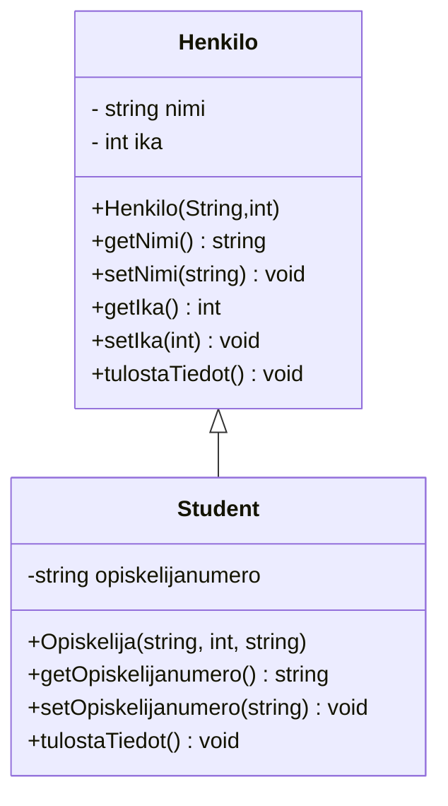

# Luokkakaavio

Luokka **Opiskelija** perii luokan **Henkilo**

```mermaid
classDiagram
    class Henkilo {
        - string nimi
        - int ika
        +Henkilo(String,int)
        +getNimi() string
        +setNimi(string) void
        +getIka() int
        +setIka(int) void
        +tulostaTiedot() void

    }

    class Student{
        -string opiskelijanumero
        +Opiskelija(string, int, string)
        +getOpiskelijanumero() string
        +setOpiskelijanumero(string) void
        +tulostaTiedot() void
    }
    Henkilo <|-- Student
```