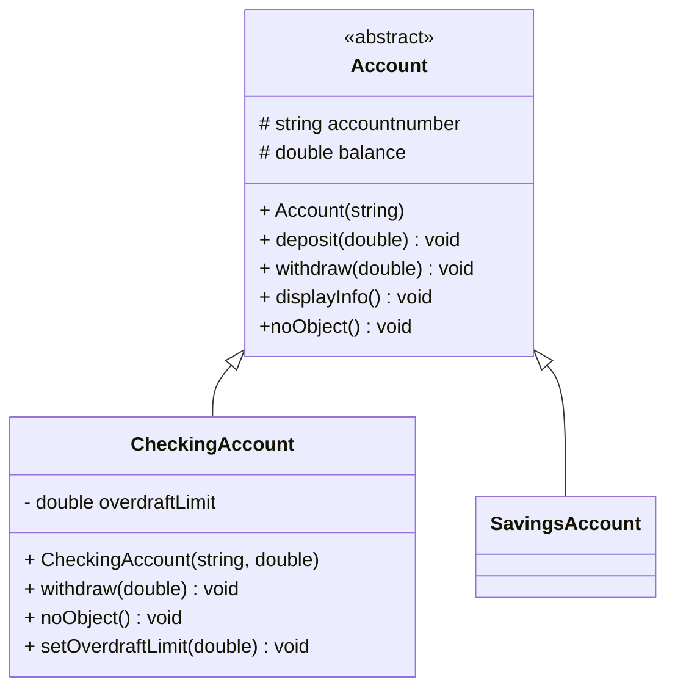

#Pankkitilijärjestelmän luokkakaavio#

```mermaid
classDiagram
    class Account{
    <<abstract>>
    # string accountnumber
    # double balance
    + Account (string)
    + deposit(double) void
    + withdraw (double) void
    + displayInfo() void
    +noObject() void
}
    class CheckingAccount{
    - double overdraftLimit
    + CheckingAccount(string, double)
    + withdraw(double) void
    + noObject() void
    + setOverdraftLimit(double) void
    }
    class SavingsAccount{

    }
    Account <|-- CheckingAccount
    Account <|-- SavingsAccount
```